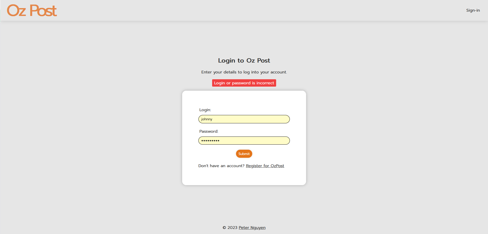
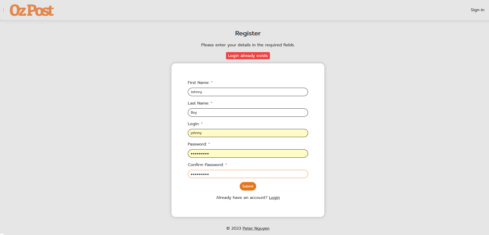
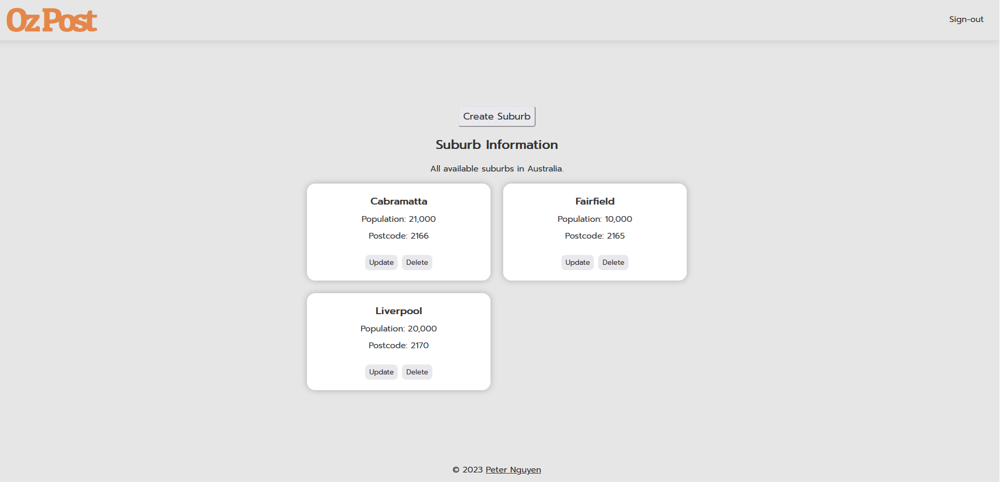

# Postcode API

## App Images

## Requirements / Purpose
This was originally a backend project but I've decided to include a frontend because I wanted to see how all its features functioned end-to-end.

The backbone of this project are the REST APIs made with SpringBoot. This project specifically builds upon a simple CRUD REST API due to the database schema constraints. This is because the suburb table relies on a foreign key from the postcode table, therefore a lot more thought and attention has been placed to keep the server DRY and loosely coupled. 

It also includes security practices such as authorization and authentication. I've decided to use JWT as authorization and a simple username/password combo as authentication. Currently it does not handle CSRF attacks for the sake of simplicity. The JWT is also stored in localStorage.

The frontend is built with Vite/React/TS and is **currently** using the following dependencies (subject to change):
- Yup (for form validation)
- React Hook Forms
- React Query
- Redux Toolkit
- React Router Dom
- Axios
- SASS
- Cypress

Has E2E and component tests.

The server endpoints allow users to:
  - Create suburb and postcode in a single request
  - Create postcode separately
  - Read suburb or postcode information
  - Read suburb information from postcode
  - Read postcode from given suburb
  - Update suburb or postcode
  - Delete suburb
  - Login
  - Register
  
On the frontend users can:
  - Login
  - Register
  - Create a suburb
  - Delete a suburb
  - Update a suburb
  - Read all suburbs
 
**With these functionalities in place the app meets its MVP** but more will be included overtime. 

## Approach / Justifications
- The suburb table has a foreign key of postcode, this allows for better separation of concerns and encapsulation as many suburbs can have the same postcode
- I decided to omit a delete endpoint for postcode simply because it acts as a foreign key for suburb
- Passwords are salted and hashed using Bcrypt before saving to the database as per best practices (https://docs.spring.io/spring-security/reference/features/authentication/password-storage.html)
- The components CreateSuburbForm and UpdateSuburbForm repeats a lot of the same code but I decided to leave it as is for the sake of readability.
- Cypress will be used in place of React Testing Library and Jest for the sake of development speed (solo developer)

## Future Goals
- Testing suites for backend
- CSRF implementation(?)
